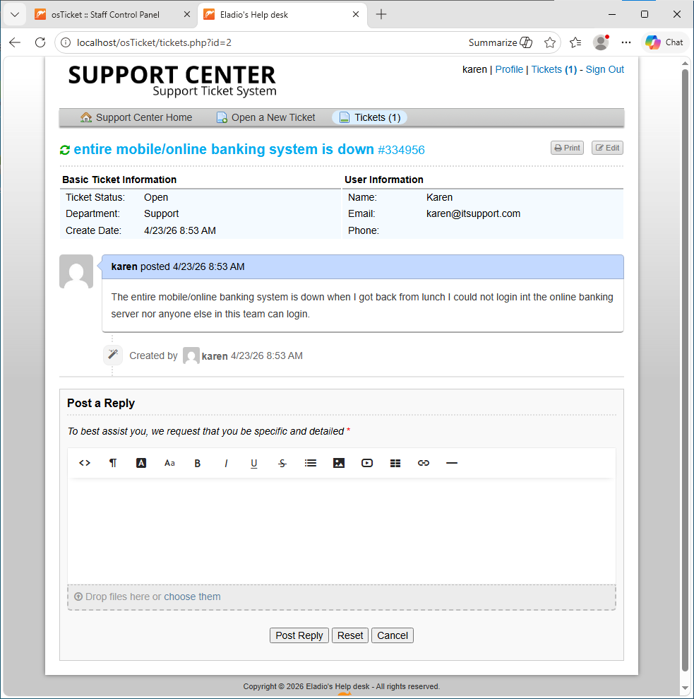
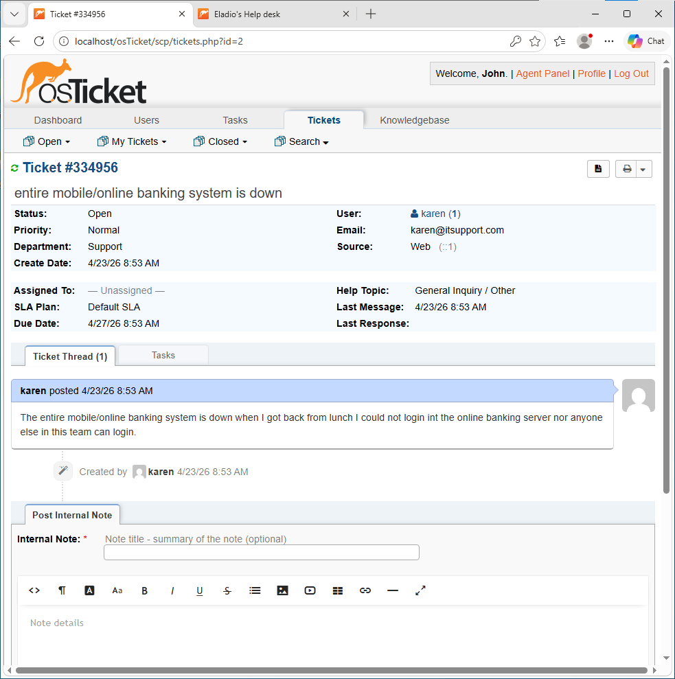
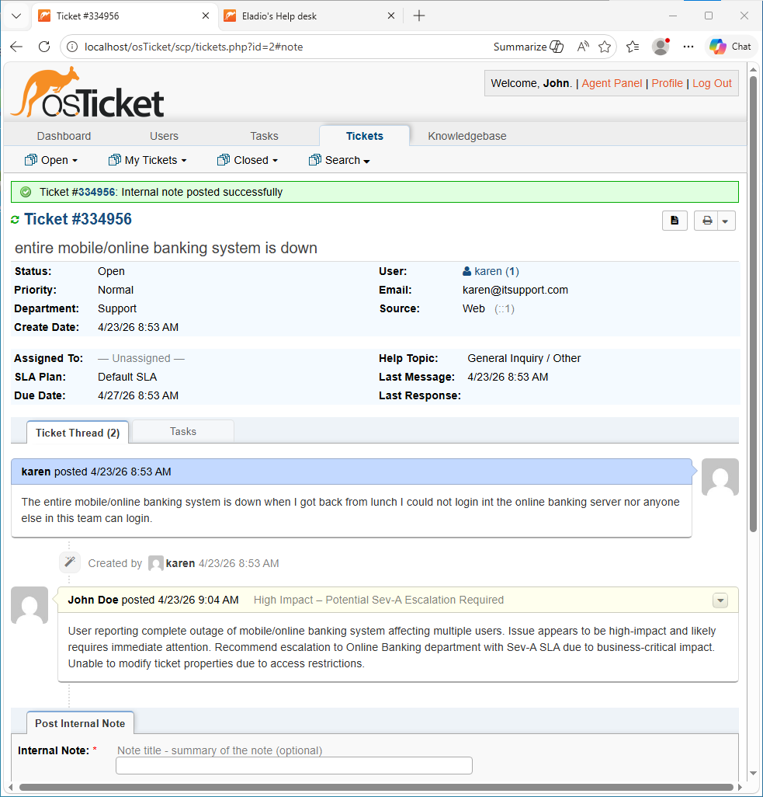
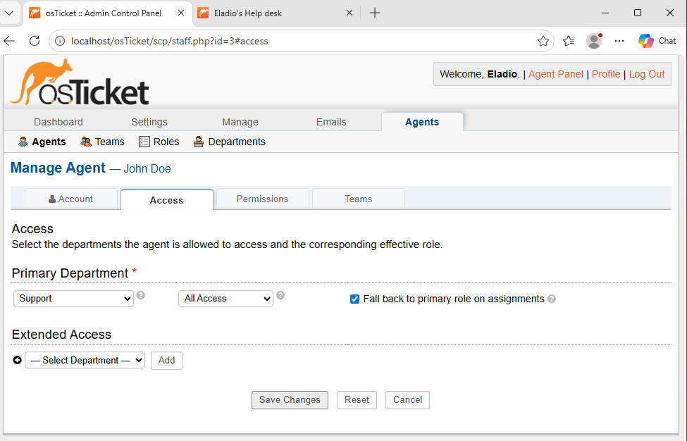
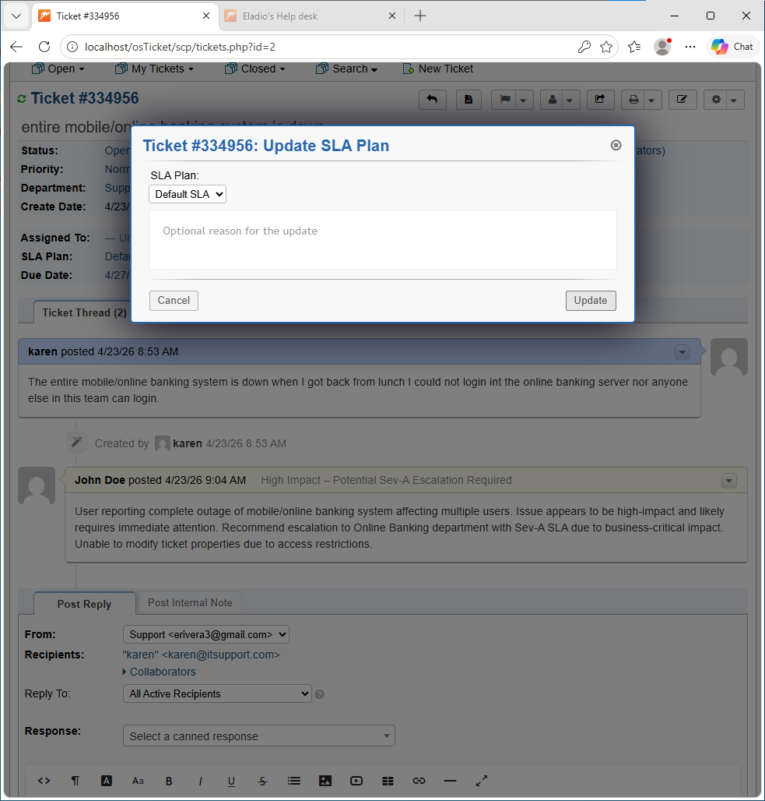
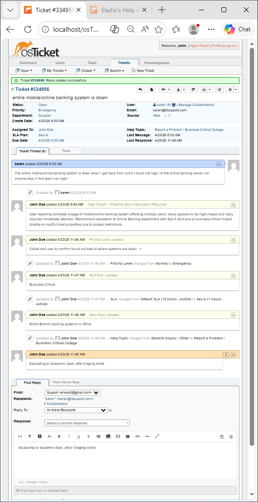
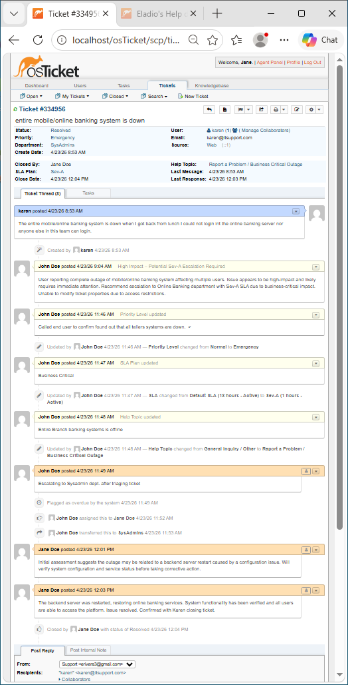

  

<h1 align="center">osTicket: Ticket Lifecycle Examples (Enterprise Simulation)</h1>

This project demonstrates the operational behavior of a help desk system using osTicket, focusing on how tickets progress through a complete lifecycle under real-world conditions. The simulation highlights how role-based access control, administrative intervention, SLA enforcement, and escalation workflows impact ticket visibility, ownership, and resolution. The objective is to analyze how system configuration governs what actions are possible at each stage of the ticket lifecycle.

---

## 🎯 Goals & Objectives

The goal of this project was to simulate realistic help desk operations and evaluate how ticket lifecycle processes interact with system configuration and user permissions. By the end of this lab, I aimed to:

- Simulate an end-to-end ticket lifecycle from creation to resolution  
- Analyze how SLA and priority impact ticket handling  
- Demonstrate role-based access control and its operational limitations  
- Observe system behavior when agents lack sufficient permissions  
- Implement administrative intervention to modify access levels  
- Execute escalation workflows based on business impact  
- Maintain a complete audit trail of ticket activity  

---

## 📌 Overview

This lab was conducted within a locally deployed osTicket environment. Multiple agents interacted with the same ticket under different permission levels to simulate real-world support workflows. The focus was on system behavior—how tickets are assessed, escalated, restricted, and ultimately resolved—rather than on deployment or installation.

---

## 🧰 Technologies Used

- osTicket  
- PHP  
- MySQL  
- Apache / IIS  
- Web Browser  

---

## 💻 Environment

- OS: Windows (Localhost deployment)  
- Platform: osTicket running on local web server  
- Admin Panel: `http://localhost/osTicket/scp/login.php`  
- End-User Portal: `http://localhost/osTicket`  

---

## ⚙️ Implementation

### 1. Ticket Intake

A ticket was created by an end user reporting a critical outage affecting the mobile and online banking system. This served as the entry point into the help desk system.

**Why it matters:**  
Ticket intake is the foundation of all support operations. Without structured intake, issues cannot be tracked, prioritized, or resolved systematically.

  

---

### 2. Initial Assessment

An agent (john) reviewed the ticket and observed that it lacked proper classification, including SLA assignment, priority level, and department routing.

**Why it matters:**  
New tickets often enter the system unstructured. Proper assessment is required to ensure accurate routing and prioritization.

  

---

### 3. Internal Documentation & Escalation Recommendation

Due to limited permissions, the agent documented the issue using an internal note, identifying it as a high-impact outage and recommending escalation.

**Why it matters:**  
Restricted agents must rely on documentation to communicate findings. Internal notes serve as a critical bridge between assessment and action.

  

---

### 4. Role-Based Access Restriction

The same agent (john) was limited to read-only interaction and internal documentation, without the ability to modify ticket properties such as SLA, department, or assignment. All configuration controls were restricted, preventing direct escalation or reassignment.

**Why it matters:**  
Access control enforces operational boundaries within support systems. Agents may assess and document issues but are not always authorized to act on them. This ensures accountability and prevents unauthorized changes, while requiring escalation to higher-permission roles for further action.

---

### 5. Administrative Intervention & Permission Escalation

An administrator modified the agent’s permissions, upgrading the restricted agent to a role with full access. This change enabled direct handling of the escalated issue.

**Why it matters:**  
Administrative control governs system behavior. Permission changes directly impact what actions agents can perform and can resolve workflow bottlenecks when access limitations prevent progress.

  

---

### 6. Restored Access & Ticket Control

After permissions were updated, the agent regained the ability to modify ticket properties, including SLA configuration, assignment, and department routing.

**Why it matters:**  
Permission changes propagate immediately to operational workflows. This demonstrates the dependency between administrative configuration and real-time system capability.

  

---

### 7. SLA Enforcement & Ticket Escalation

The ticket was escalated to reflect its business-critical impact by assigning a **Sev-A SLA (1 hour, 24/7)** and elevating its priority to **Emergency**. Additional updates refined classification and ensured routing to the appropriate department.

**Why it matters:**  
SLA and priority define urgency and resource allocation. Proper escalation ensures that critical incidents receive immediate attention and are handled by the correct team.

  

---

### 8. Resolution & Closure

The issue was investigated, resolved, and verified. The ticket was then marked as resolved, completing the lifecycle and preserving a full audit trail of actions taken.

**Why it matters:**  
Closure confirms that the issue has been addressed and ensures accountability. Complete lifecycle tracking is essential for reporting, auditing, and continuous improvement.

  

---

## 🔍 Troubleshooting

### Restricted Agent Unable to Modify Ticket
- Problem: Agent could view but not modify ticket  
- Cause: Role-based access limitations  
- Fix: Admin updated permissions to grant required access  

---

### Incomplete Initial Classification
- Problem: Ticket entered system without SLA or proper priority  
- Cause: Default intake lacks contextual classification  
- Fix: Agent assessment followed by manual escalation  

---

### Escalation Required for Critical Issue
- Problem: High-impact outage initially treated as normal priority  
- Cause: Lack of initial severity assessment  
- Fix: Applied Sev-A SLA and elevated priority  

---

## 🧠 Design Decisions

- **Role-Based Access Enforcement**  
  Maintained restricted agent roles to simulate separation of duties and realistic escalation workflows  

- **Administrative Override Model**  
  Used admin intervention to demonstrate dynamic permission control and its effect on system behavior  

- **High-Severity Scenario Selection**  
  Selected a system-wide outage to highlight SLA enforcement and escalation urgency  

---

## 🛡️ System Awareness

- Ticket behavior depends on **user roles and permissions**  
- SLA policies influence urgency but do not override access restrictions  
- Administrative changes directly affect operational capabilities  
- Misconfigured roles can block or delay resolution  
- Ticket lifecycle progression depends on both **system configuration and agent decisions**  

---

## 🌍 Real-World Relevance

- Help desk systems are critical for managing IT incidents in enterprise environments  
- Role-based access control ensures security and accountability  
- SLA enforcement supports service reliability and performance tracking  
- Ticketing systems provide traceability for audits and operational metrics  

---

## 📌 Lessons Learned

- Access control can both protect and hinder workflow efficiency  
- Proper ticket classification is critical for effective routing  
- Escalation is necessary when permissions or expertise are limited  
- Administrative intervention plays a key role in resolving bottlenecks  
- Maintaining a full audit trail improves accountability and system transparency  

---

## 💭 Key Takeaways

- Ticket lifecycle management is governed by system configuration, not just user actions  
- Permissions, escalation, and SLA policies work together to shape system behavior  
- Understanding system constraints is essential for effective help desk operations  
